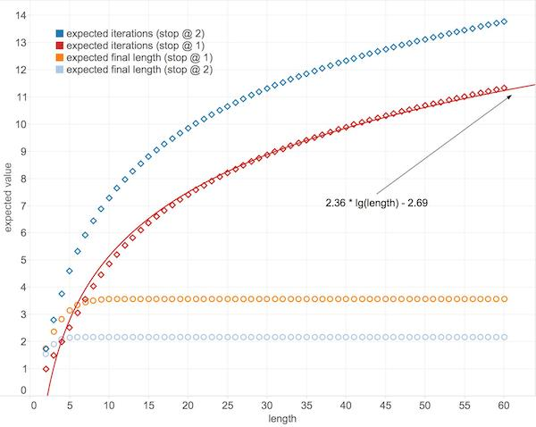

Digraph: a Directed Graph library
=================================

By Philip M. Hubbard, 2014

Overview
--------

Digraph is a Java library that implements directed graphs.  It has some functionality for processing directed graphs with [MapReduce](http://en.wikipedia.org/wiki/MapReduce) algorithms in [Hadoop](https://hadoop.apache.org).  While Digraph has general capabilities, it was specifically designed to support the [Sabe](http://github.com/philiphubbard/Sabe) library, for experiments in DNA sequence assembly by Euler tours.

Sequential Functionality
------------------------

The abstract `Digraph<E>` generic class implements some common directed graph functionality, where vertices are specified by `int` indices and edges are specified by the generic type parameter.  The idea is that a subclass class could specify custom data for the vertices by using vertex-indexed lists, and custom data for the edges through the generic type parameter.  Algorithms that do not need to add edges, like Euler tour computation, can use the `Digraph<E>` class interface.

Operations supported by `Digraph<E>` include adding edges, removing edges and iterating over edges adjacent to a vertex.  Edge multiples---more than one edge between the same pair of vertices---are also supported if enabled when the `Digraph<E>` instance is created.

The simplest subclass of `Digraph<E>` is `BasicDigraph`, which has no custom data for the vertices or edges.  The `WeightedDigraph` subclass of `Digraph<E>` implements edges with `float` values as weights.

The `EulerPaths` class computes [*Euler tours*](http://en.wikipedia.org/wiki/Eulerian_path) of of `Digraph<E>` instances, that is, paths that visit every edge exactly once.  The class implements a classic algorithm with processing time that is linear in the number of edges.  An advantage of this implementation over some is that it does not remove the edges from the graph as it computes the tour.

The `StrongComponents` class computes the strong components (also known as a [*strongly connected component*](http://en.wikipedia.org/wiki/Strongly_connected_component)) of a `Digraph<E>` instances.  Two vertices, `V` and `W`, are in the same strong component if there is a path from `V` to `W` and also a path from `W` to `V`.  The implementation uses a classic algorithm from Tarjan that is linear in the size of the graph (the sum of the number of vertices and the number of edges).

MapReduce (MR) Functionality
-----------------------------

The `MRVertex` class implements a directed-graph vertex for use with Hadoop MapReduce algorithms.  To support the distributed nature of MapReduce, this vertex is independent of a global graph structure like `Digraph<E>`; instead, each `MRVertex`
keeps its own record of the indices of its adjacent vertices, and can read and write this information from and to a `hadoop.io.BytesWritable` instance.

A `MRVertex` instance supports the addition and removal of edges, specified by the index of the vertex the edge points from or to.  An edge to be added also can be specified with an instance of the `MREdge` class, but it is merely a convenience; `MRVertex` does not keep track of explicit edge structures (and as such cannot support weighted edges the way the `WeightedDigraph` class does).  Edge multiples are supported if a `hadoop.conf.Configuration` property is set.  Iterators are available to loop over the vertices a `MRVertex` has edges from or to.  There are static routines to examine the header of the `hadoop.io.BytesWritable` representation of a `MRVertex` to check whether it has been marked as a branch, a source or a sink.

Those header properties of a `MRVertex` are examples of what is computed by the `MRBuildVertices` class.  It implements a MapReduce algorithm to generate output files of `MRVertex` instances from input files of arbitrary formats.  A subclass of `MRBuildVertices` defines a function that the mapper uses to parse the input files and generate initial versions of the `MRVertex` instances.  Multiple mappers may each have only some of the data that defines a `MRVertex` (e.g., each may know about only some of the edges) so the reducer "merges" the representations generated by the mappers to build the final `MRVertex`.  If a `hadoop.conf.Configuration` property is set then the final `MRVertex` will be written to different result directories depending on whether it is a branch vertex or a chain vertex.  A `hadoop.conf.Configuration` property can also be set to define the *coverage* used for error handling.  If coverage is set and a vertex has fewer than `ceiling(coverage / 2)` edges to other vertices (which need not be distinct, if edge multiples are enabled) then the vertex is considered to be an error and no `MRVertex` is created.

The `MRVertex` class also provides routines for *chain compression*, which are used by the `MRCompressChains` class.  Chain compression involves replacing three vertices connected in a row with just the first and third (e.g., `A->B->C` becomes `A->C`).  Repeated iterations of this procedure can simply a graph that consists of many long chains and relatively few branches (as is the case for the [Sabe](http://github.com/philiphubbard/Sabe) library).  The MapReduce version of this idea implemented by `MRCompressChains` involves randomization, to allow the work to be distributed.  In essence, each `MRVertex` randomly picks "heads" or "tails", and compression will occur only if a "tails" precedes a "heads" in the chain (e.g., `A->B->C` becomes `A->C` only if `A` picks "tails" and `B` picks "heads").  This approach prevents compressions that would preclude further compressions (e.g., compressing `A->B->C` to `A->C` and `B->C->D` to `B->D`).  In `MRCompressChains`, the mapper performs the random choice of "heads" or "tails" and produces keys for the reducer that group only legitimate candidates for compression (e.g., if `A->B` and `B->C` both generate `B` as a key then compression is legitimate). The reducer uses routines from `MRVertex` to perform the compression, and hooks allow `MRVertex` subclasses to compress their data (e.g., DNA nucleotide data for the case of the [Sabe](http://github.com/philiphubbard/Sabe) library).

Performance
-----------

As mentioned earlier, the sequential algorithms for finding Euler tours and strong components run in linear time.  Characterizing the performance of the MapReduce algorithm in `MRCompressChains` is more complicated.

The most important performance consideration for `MRCompressChains` is the number of MapReduce iterations it must perform, since each iteration involves some overhead.  A useful statistic is `e[n]`, the expected value for the number of iterations given a chain of starting length `n`.  The probability component of this value depends on `c[n][m]`, the number of different ways a chain of length `n` can have `m` compressions.  Finding a closed-form expression for either `e[n` or `c[n][m]` is challenging, but both can be solved numerically using dynamic programming.

To compute `c[n][m]`, consider an analogy to `n`-digit binary numbers.  As discussed above, a legitimate candidate for compression is a pair of adjacent vertices where the first has "tails" as its key and the second has "heads"; an analogous situation is the occurrence of the substring "01" in an `n`-digit binary number.  So `c[n][m]` becomes the number of `n`-digit binary numbers containing `m` "01" substrings, and is defined by the following recurrence relations.  If an `n`-digit binary number starts with "1", then `c[n][m] = c[n-1][m]` because the initial "1" adds no new occurrences of "01" beyond what is present in `n-1`-digit numbers.  If the number does not start with "1" it could start with "01", in which case `c[n][m] += c[n-2][m-1]` because every `n-2`-digit number with "01" `m-1` times becomes an `n`-digit number with "01" one more time or `m` times.  If the number does not start with "01" it could start with "001", in which case `c[n][m] += c[n-3][m-1]` because every `n-3` digit number with "01" `m-1` times becomes a `n`-digit number with "01" `m` times.  Similarly, the case of an initial "0001" leads to `c[n][m] += c[n-4][m-1]` and so on, giving a loop that fully defines `c[n][m]` in terms of values of `c` for shorter lengths.

As an aside, the number of different ways there can be no compressions, `c[n][0]`, does have a simple closed form.  The only `n`-digit binary numbers without any "01" substrings must either consist of only "0" digits or must start with "1" and have only one transition from "1" to "0" (e.g., "1000...0", "1100...0", "1110...0", ..., "1111...1").  There are `n+1` of those numbers altogether, and that is `c[n][0]`.  So the probability that an iteration will have no compressions is `(n+1) / 2^n`.

The computation of `e[n]`, the expected number of iterations for a chain of length `n`, uses `c[n][m]`.  Consider first the case of `m > 0`.  In this case, `e[n] += c[n][m] / 2^n * (1 + e[n-m])`; the probability of `m` compressions is `c[n][m] / 2^n`, and when `m` compressions occur there is 1 iteration plus the expected number of iterations for a chain `m` elements shorter.  If `m = 0` then this iteration did not change the length, so `e[n] += c[n][0] / 2^n * (1 + e[n])`, which is an infinite loop.  To break it, consider the termination condition for the iteration.  If the `MRCompressChains` terminates whenever an iteration does no compressions, then the expression simplifies to `e[n] += p0 * 1`, where `p0 = c[n][0] / 2^n`, the probability of no compressions.  Another approach is to terminate if two iterations in a row have no compressions.  In this case, the expression is `e[n] += p0 * (1 + x + p0 * 1)`, where `x` is the sum over `m` of those `c[n][m] / 2^n * (1 + e[n-m])` terms mentioned earlier, which are another way of describing `e[n]` for the case of non-zero compressions.  These expressions lead to a loop that computes `e[n]` in terms of terms of `e` for shorter lengths.

The values of `e[n]` for `n <= 60` are computed in `MRCompressChainsAnalyze`.  It does the computation for both terminations conditions: terminating after one iteration with no compressions, or after two such iterations.  It also computes `e'[n]`, the expected final length of a chain that starts with length `n`, for the two termination conditions.  The derivation of `e'[n]` is quite similar to the derivation of `e[n]`, above.

Based on the computations of `e[n]` and `e'[n]`, the best termination condition is to terminate after only one iteration with no compressions.  The graph of the results, below, illustrates the argument.  Terminating after only one iteration with no compressions leads to a final chain that is expected to be about two elements longer, but also saves two or three iterations.  Given the overhead of the iterations, avoiding the extra iterations is most beneficial.

This graph also illustrates that the `e[n]` for terminating after one iteration with no compressions is fit well be the curve `2.36 * lg(n) - 2.69`. 

Testing
-------

The main routine of the `DigraphTest` class calls routines from the `BasicDigraphTest`, `EulerPathsTest`, `MRVertexTest`, `StrongComponentsTest` and `WeightedDigraphTest` classes to run confidence tests on the `BasicDigraph`, `EulerPaths`, `MRVertex`, `StrongComponents` and `WeightedDigraph` classes, respectively.  These tests use `assert()` so the run configuration must be set to include "-ea" in the VM arguments.

The `MRBuildVerticesTest` and `MRCompressChainsTest` classes implement Hadoop drivers for the `MRBuildVertices` and `MRCompressChains` classes.  Currently, these tests simply print output to demonstrate that the MapReduce algorithms run.

Building
--------

This library was developed with the Eclipse Kepler (4.3.1) IDE on OS X (10.9.4).  The Hadoop-related classes require that the following external JARs from the Hadoop 2.2.0 installation be added (e.g., through the "Build Path/Configure Build Path.../Libraries/Add External JARs..." menu in Eclipse):

* share/hadoop/common/lib/commons-cli-1.2.jar
* share/hadoop/common/hadoop-common-2.2.0.jar
* share/hadoop/mapreduce/hadoop-mapreduce-client-core.2.2.0.jar
* share/hadoop/common/lib/commons-logging-1.1.1.jar
* share/hadoop/common/lib/guava-11.0.2.jar

The latter two were necessary only to allow the confidence tests to create `hadoop.conf.Configuration` instances for testing `MRVertex` without using other Hadoop functionality.

Future Work
-----------

* The `EulerPaths` class does not check that all the vertices in the `Digraph<E>` meet the condition necessary for the existence of an Euler tour: that every vertex in the graph has an in degree that equals its out degree.  Processing a graph that does not meet this condition will have unpredictable results.  There should be heuristics to deal with this situation, as it could occur in the use of this class by [Sabe](http://github.com/philiphubbard/Sabe), the library for genome sequence assembly based on Euler tours.  The result would be paths that are not necessarily real tours, hence the name of this class.

* It ought to be possible to make the `Digraph<E>.AdjacencyIterator` and `MRVertex.AdjacencyIterator` classes use the `Iterator<A>` interface.

* The confidence tests currently do not use the [JUnit](http://junit.org) class framework for unit tests.  Perhaps they should.
